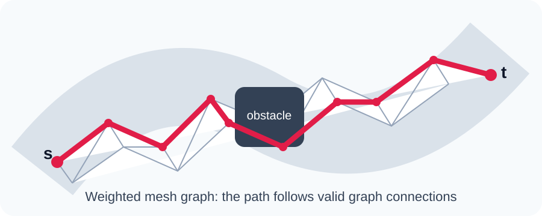
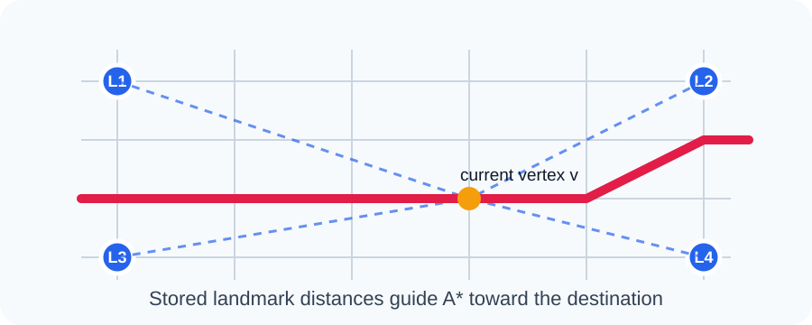
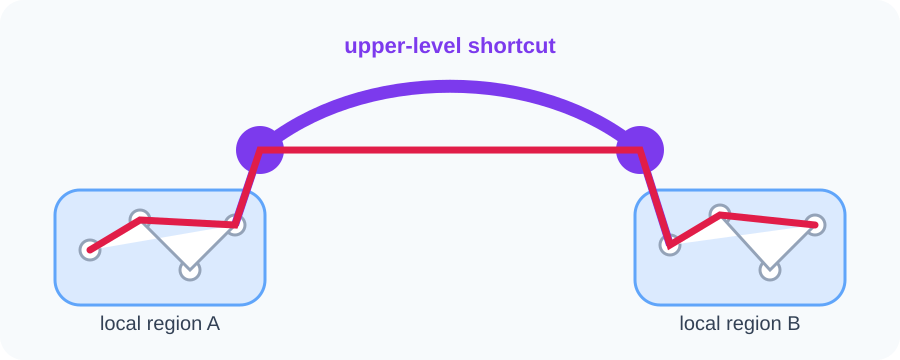
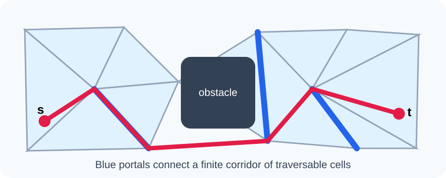
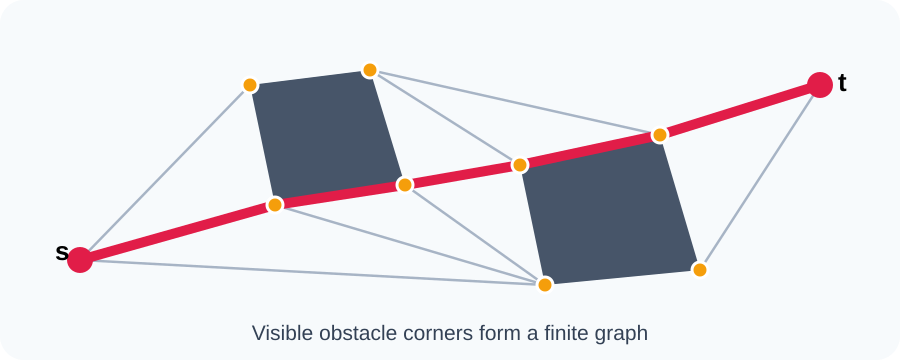
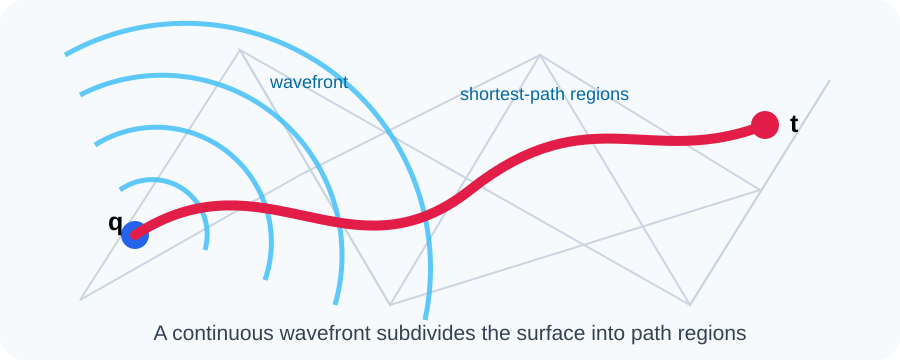
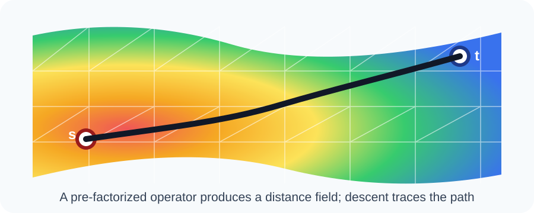

# Index-Based Shortest Paths in Riemannian Spaces with Obstacles

## Problem definition

Let \((M,g)\) be a Riemannian space with static obstacle set \(O\). For arbitrary query points \(s,t\in M\setminus O\), we seek a collision-free path minimizing Riemannian length:

\[
\gamma^*=\arg\min_{\gamma:s\rightarrow t,\;\gamma\cap O=\varnothing}
\int_0^1\sqrt{\dot\gamma(u)^Tg(\gamma(u))\dot\gamma(u)}\,du.
\]

An index stores a **finite summary** of the continuous space. Arbitrary query points are located and connected to that summary at query time; they are not all indexed individually.

## Classical index families

There is no universally fixed taxonomy. The following seven families provide a useful systematic classification for repeated shortest-path queries.

| Method | Relevant illustration | Brief introduction |
|---|---|---|
| **1. Discretized graph index** |  | Approximate the manifold using a mesh, grid, or sampled point set. Samples become vertices, valid local movements become edges, and Riemannian lengths become weights. Dijkstra or A* returns a path that is exact on the graph but generally approximate on the continuous manifold. |
| **2. Landmark or distance-oracle index** |  | Select a small set of landmarks and precompute their distances to graph vertices. At query time, stored distances provide lower bounds or approximate distance estimates that guide the search and reduce the number of explored vertices. ALT and landmark embeddings are representative examples. |
| **3. Hierarchical graph index** |  | Organize the graph into local and global levels. Higher levels contain important hubs, separators, regions, or shortcut edges. A query leaves the source region, crosses a small upper-level structure, and descends near the destination. Contraction hierarchies and separator indexes belong here. |
| **4. Cell-and-portal index** |  | Divide free space into traversable cells, normally triangles or convex polygons. Shared boundaries are finite portals. A query locates the cells containing \(s\) and \(t\), searches for a cell corridor, and refines the route through its portals. Navigation meshes and funnel algorithms use this model. |
| **5. Obstacle-feature or visibility index** |  | Index critical obstacle features such as corners or tangency points. Connect two features when a valid local geodesic can travel between them. Query points are temporarily connected to visible features. This can produce exact paths in suitable polygonal settings, although the graph may become dense. |
| **6. Continuous shortest-path map** |  | Propagate a continuous geodesic wavefront across mesh faces and construct regions sharing a common shortest-path description. A query locates the destination region and reconstructs a path that may cross triangle interiors. Continuous Dijkstra and polyhedral shortest-path maps are standard examples. |
| **7. Numerical-operator index** |  | Precompute and factorize discrete differential operators, commonly involving the Laplace–Beltrami operator. A new source requires only relatively cheap numerical solves to produce a distance field, after which a path is traced by descending the field. The heat method is a representative approach. |

## Comparison

| Method | Indexed object | Query mechanism | Main strength | Main limitation | Accuracy |
|---|---|---|---|---|---|
| Discretized graph | Mesh/grid vertices and weighted edges | Dijkstra or A* | Simple and broadly applicable | Resolution and directional error | Exact on graph only |
| Landmark/distance oracle | Landmark-to-vertex distances | Landmark-guided A* or lookup | Faster repeated graph queries | Extra storage and landmark selection | Exact on graph with admissible ALT |
| Hierarchical graph | Regions, hubs, separators, shortcuts | Upward/global/downward search | Extremely fast large-scale queries | Complex preprocessing and updates | Often exact on graph |
| Cell and portal | Traversable cells and shared portals | Corridor search and funnel refinement | Handles arbitrary query points naturally | Depends on decomposition quality | Exact in some planar corridors |
| Obstacle feature | Corners, tangencies, visibility edges | Temporary query connections plus graph search | Exploits obstacle geometry directly | Visibility graph may be quadratic | Can be exact in suitable settings |
| Continuous shortest-path map | Wavefront events and path regions | Point location and path reconstruction | Accurate paths across mesh faces | Expensive and often source-dependent | Can be exact on polyhedral surfaces |
| Numerical operator | Sparse differential operators and factorizations | Linear solves and gradient descent | Smooth distance fields with reusable preprocessing | Numerical approximation and boundary handling | Usually approximate |

## How arbitrary query points use the index

| Query step | Operation |
|---|---|
| **1. Point location** | Find the triangle, cell, or local region containing \(s\) and \(t\). |
| **2. Local connection** | Connect \(s\) and \(t\) temporarily to nearby vertices, portals, visible features, or a numerical field. |
| **3. Indexed global search** | Reuse precomputed landmark distances, shortcuts, portal distances, visibility edges, path regions, or matrix factorizations. |
| **4. Reconstruction** | Combine local and global portions to recover the complete path. |
| **5. Refinement** | Optionally smooth the path across mesh faces while preserving obstacle avoidance. |

A typical portal-based query has the form

\[
d(s,t)\approx\min_{p_i,p_j}
\left[d_{\mathrm{local}}(s,p_i)+D(p_i,p_j)+d_{\mathrm{local}}(p_j,t)\right].
\]

Only the middle term is globally indexed; the two local terms are calculated when the query arrives.

## Supporting spatial index

| Supporting structure | Purpose |
|---|---|
| AABB tree or bounding-volume hierarchy | Locate points on a triangle mesh and accelerate collision tests |
| R-tree | Index spatial regions, cells, and obstacle bounding boxes |
| k-d tree | Find nearby samples, landmarks, or mesh vertices |

These structures support the path index but do not solve the shortest-path problem by themselves.

## Practical combinations

| Intended system | Recommended combination |
|---|---|
| Simple research prototype | Mesh graph + AABB tree + A* |
| Many queries on a static mesh | Mesh graph + landmarks or graph hierarchy |
| Obstacle-rich planar environment | Navigation mesh + portal graph + funnel refinement |
| Polygonal obstacles requiring exact paths | Visibility graph + spatial collision index |
| Accurate geodesics on a polyhedral surface | Continuous shortest-path method + point-location index |
| Smooth approximate surface distances | Heat method + pre-factorized differential operators |

The families can be combined. For example, a system may use an AABB tree for point location, a navigation mesh for representation, landmarks for global search, and a continuous method for final refinement.

## Related software and references

| Resource | Relevant capability |
|---|---|
| [libigl tutorial](https://libigl.github.io/tutorial/) | Mesh representation, AABB trees, exact discrete geodesics, and heat geodesics |
| [CGAL surface-mesh shortest-path examples](https://doc.cgal.org/latest/Surface_mesh_shortest_path/examples.html) | Continuous shortest paths on triangulated surfaces |
| [Geometry Central](https://geometry-central.net/) | Intrinsic triangulations and surface-distance algorithms |
| [NetworkX A*](https://networkx.org/documentation/stable/reference/algorithms/generated/networkx.algorithms.shortest_paths.astar.astar_path.html) | Graph-search prototyping |

> All seven illustrations in this document are original project-local SVGs and may be reused or modified in presentation slides.
